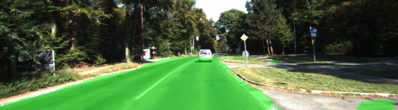
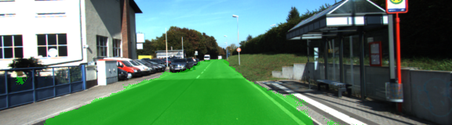

# Semantic Segmentation Project

## Project Objectives
The objectives of this project are to develop a convolutional neural network based on the VGG-16 image classifier for performing semantic segmentation and in order to determine the area in an image that is a road, as well as processing a video stream of data in real time. The KITTI dataset is used for training our model and providing all the test images too.

## Network Architecture
The network uses a pretrained VGG-16 model that gets converted to a fully convolutional network that has two classes. The final fully connected layer is converted to a 1x1 convolution. Additionally to increase performance the network is using skip connections with 1x1 convolutions on VGG layers that are added element wise and upsampled. A kernel initializer and regularizer are also used in each convolution and transpose convolution layers and have proved to increase performance and reduce loss significantly. 

## Output images

After 30 epochs loss per batch is on average around 0.065. Below you can see some sample images from the last run.




### Setup
##### Frameworks and Packages
Make sure you have the following is installed:
 - [Python 3](https://www.python.org/)
 - [TensorFlow](https://www.tensorflow.org/)
 - [NumPy](http://www.numpy.org/)
 - [SciPy](https://www.scipy.org/)

##### Dataset
Download the [Kitti Road dataset](http://www.cvlibs.net/datasets/kitti/eval_road.php) from [here](http://www.cvlibs.net/download.php?file=data_road.zip).  Extract the dataset in the `data` folder.  This will create the folder `data_road` with all the training a test images.

### Start
##### Run
Run the following command to run the project:
```
python main.py
```
**Note** If running this in Jupyter Notebook system messages, such as those regarding test status, may appear in the terminal rather than the notebook.
